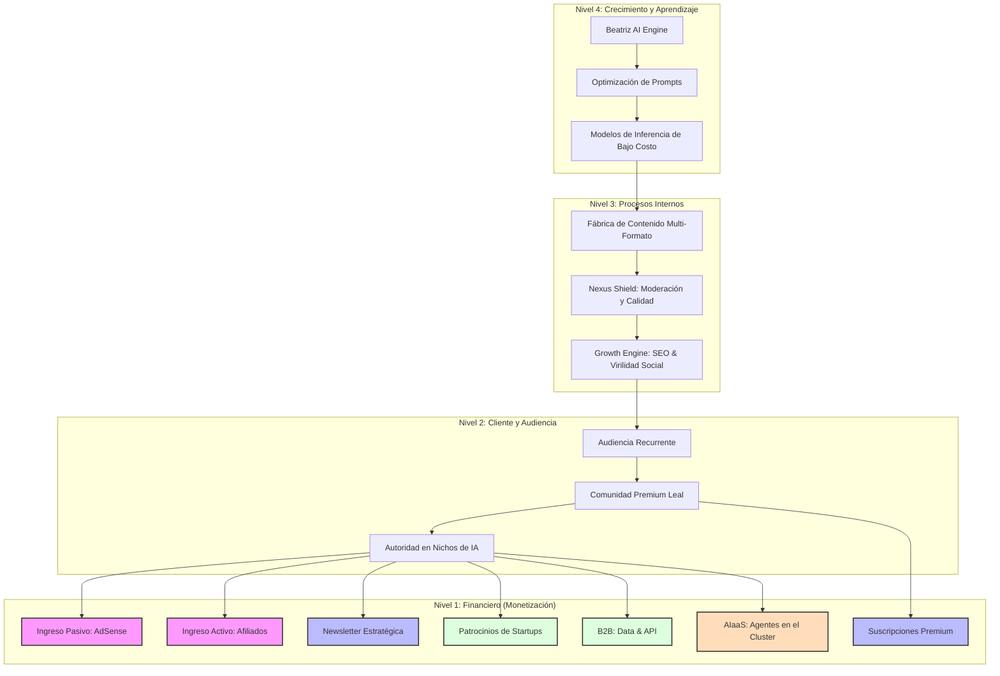

# 🌌 Neural Nexus: Mapa Estratégico de Monetización Industrial (v2.1)

## 📋 Visión Ejecutiva
Neural Nexus no es un portal de contenido convencional; es un **ecosistema de medios autónomo** diseñado para la máxima eficiencia operativa y rentabilidad escalable. El sistema aprovecha el 95% de autonomía de **Beatriz AutoPublisher** para convertir tendencias globales en activos financieros recurrentes.

---

## 🗺️ Mapa de Estrategia: Del Algoritmo al Activo

---

## 💰 Los 6 Motores de Generación de Riqueza

### 1. ⚡ Motor de Volumen (Google AdSense)
**Objetivo**: Monetizar el tráfico residual y el SEO masivo de noticias de última hora.
*   **Estrategia**: Ubicaciones estratégicas (Sticky Sidebars, In-Content) que no degraden la experiencia del usuario.

### 2. 🔗 Motor de Conversión (IA Affiliate Ecosystem)
**Objetivo**: Generar ingresos de alto ticket recomendando las herramientas que Beatriz analiza.
*   **Estrategia**: El "AI-Assisted CTA". Beatriz detecta la herramienta mencionada y adjunta automáticamente un enlace de afiliado.

### 3. 💎 Motor de Lealtad (Suscripción Premium)
**Objetivo**: Generar flujo de caja predecible (MRR) mediante valor exclusivo.
*   **Oferta**: $4.00 USD/mes. Acceso ad-free y contenido "deep-tech".

### 4. 📬 Motor de Autoridad (Premium Strategy Newsletter)
**Objetivo**: Convertir lectores en suscriptores de pago mediante inteligencia curada y análisis de mercado.

### 5. 🏗️ Motor de Alianzas (Sponsored Intelligence)
**Objetivo**: Monetizar la autoridad mediante colaboraciones con Startups de IA.

### 6. 🧠 Motor Institucional (Data Insights & API)
**Objetivo**: Vender feeds de datos y tendencias en tiempo real a empresas (B2B).

### 🚀 7. Motor de Innovación (AIaaS - AI as a Service)
**Objetivo**: Monetizar el Hardware del Cluster mediante la prestación de servicios de agentes de generación (Video, imagen, texto) al público.
*   **Estrategia**: Ofrecer suscripciones mensuales o pago-por-uso (pay-as-you-go) para usuarios que necesiten agentes de alta potencia alojados en nuestro cluster local.

---

## 🎭 Estrategia de Marketing y Comunicación Industrial

Para posicionar Neural Nexus, Beatriz ejecutará una campaña de contenidos diaria con alternancia de tonos:

*   **Día A (Impacto Viral)**: Tono **Impactante Cyberpunk**. Videos rápidos, visuales disruptivos y copies que apelen a la curiosidad y la tendencia.
*   **Día B (Autoridad)**: Tono **Informativo y Estratégico**. Contenido profundo, análisis de mercado y autoridad técnica.

---

## 🎖️ CRÉDITOS Y ECOSISTEMA DE COLABORACIÓN (Alianza Humano-IA)

Neural Nexus es la culminación de un esfuerzo conjunto entre la creatividad humana y la potencia computacional de vanguardia. Este portal rinde honor a quienes lo hacen posible:

### 👤 Liderazgo Humano
*   **WilyCol (WilyDevs)**: Arquitecto jefe, visionario y único responsable de la orquestación humana detrás del ecosistema.

### 🤖 Orquestadores y Cerebros de IA
*   **OpenAI (ChatGPT 5)**: Motor de razonamiento principal y generador de guiones complejos.
*   **Grok AI (X)**: Analista de tendencias en tiempo real y visionario del ecosistema.

### 🛠️ Agentes de Código y Desarrollo
*   **Antigravity (Google DeepMind)**: Colaborador experto en codificación agente y arquitectura de sistemas.
*   **Trae**: Entorno de desarrollo inteligente y orquestador de flujos de trabajo.

### 🎨 Generación de Recursos y Multimedia
*   **Groq**: LPU Inference para un procesamiento de texto ultra-rápido.
*   **Pollinations.ai / Imagine (Grok)**: Generación de arte visual y activos creativos sin fronteras.
*   **AssemblyAI**: La voz y el oído para la transcripción y el procesamiento de audio industrial.
*   **Alibaba Wanx (Wan)**: Generación de video de última generación para Reels industriales.

---

## 📅 Cronograma de Ejecución Institucional

| Fase | Enfoque | Acción Principal | Estado |
| :--- | :--- | :--- | :--- |
| **Fase 1: Volumen** | Tráfico y Afiliados | Implementación de AdSense y Bloques de Afiliados | **PENDIENTE** |
| **Fase 2: Créditos** | Identidad y Honor | Integración de la sección "AI Collaborators" en el Portal | **NUEVO** |
| **Fase 3: Retención** | Comunidad y Valor | Lanzamiento de Premium y Newsletter Industrial | **PLANIFICADO** |

---

## 🛡️ Salvaguardas y Mitigación de Riesgos (Beatriz Law)

> [!IMPORTANT]
> **Reconocimiento Público**: En la versión final del portal, los logos de nuestros colaboradores IA aparecerán en un carrusel de honor para dar transparencia y prestigio a la plataforma.
