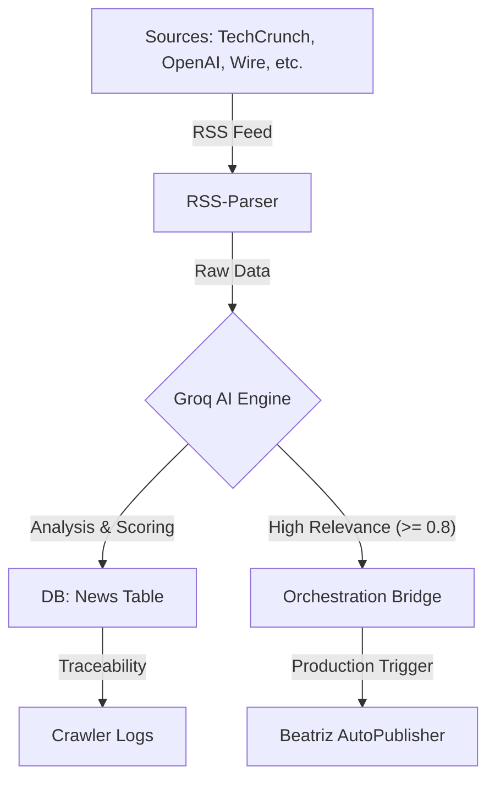

# 🌌 Motor de Búsqueda Autónomo: Análisis Profundo

Este documento detalla el funcionamiento interno del sistema de rastreo y generación de noticias de **Neural Nexus**, el cual actúa como el "vigilante digital" de la industria de la IA.

---

## 🏗️ Arquitectura del Sistema

El buscador opera como un pipeline de tres etapas: **Descubrimiento**, **Refinamiento AI** y **Publicación Estratégica**.



---

## 📡 1. Descubrimiento y Escaneo
El sistema revisa fuentes fidedignas cada ciclo de ejecución (Cron Job). Utiliza `rss-parser` para extraer contenido "limpio" de los sitios más influyentes:

| Fuente | Especialidad |
| :--- | :--- |
| **OpenAI / Anthropic** | Lanzamientos de Modelos |
| **MIT Tech Review** | Futuro y Tendencias |
| **Hugging Face** | Software y Open Source |
| **TechCrunch / VentureBeat** | Business y Inversión |

---

## 🧠 2. El "Prompt Maestro" (Motor Groq)
La calidad del portal reside en cómo se analizan los datos crudos. Este es el fragmento del **Prompt de Oro** que utilizamos en `lib/groq.ts`:

```typescript
const prompt = `Analiza esta noticia tecnológica y clasifícala obligatoriamente en una de nuestras 12 Categorías Maestras.

TÍTULO ORIGINAL: ${title}
CONTENIDO: ${content.substring(0, 2000)}
FUENTE: ${sourceName}

CATEGORÍAS DISPONIBLES:
${categories.join(', ')}

Responde SOLO con un objeto JSON válido con esta estructura:
{
  "title": "título mejorado, profesional y atractivo (máx 100 chars)",
  "summary": "resumen ejecutivo de 2-3 líneas, máximo 200 caracteres",
  "category": "UNA de las categorías mencionadas arriba",
  "tags": ["array", "de", "3-5", "tags", "técnicos relevantas"],
  "relevance_score": número entre 0 y 1,
  "should_publish": true/false (true si es noticia veraz e innovadora),
  "reason": "breve explicación técnica de la clasificación"
}`;
```

---

## 🖼️ 3. Recursos Visuales (Lógica Picsum)
Para mantener la agilidad del portal, el Crawler genera una imagen de alta calidad utilizando un motor de "semilla distribuida" (**Picsum Photos**).

*   **Lógica**: Se genera un `slug` basado en el título analizado por la IA.
*   **Implementación**:
    ```typescript
    const imageUrl = `https://picsum.photos/seed/${slug}/800/450`;
    ```
Esto asegura que cada noticia tenga una imagen coherente, variada y visualmente atractiva sin ocupar espacio excesivo de almacenamiento inicialmente.

---

## ⛓️ 4. Integración Bidireccional (Próximo Nivel)
Actualmente, el sistema está evolucionando para comunicarse con **Beatriz AutoPublisher**. 

*   **Trazabilidad**: Cada ejecución se reporta en la tabla `crawler_logs`, permitiendo que Beatriz muestre un informe administrativo.
*   **Orquestación**: Las noticias con score superior a 0.8 se envían a la tabla `top_5_tasks`, donde Beatriz las detecta e inicia la producción de video industrial.

---

## 🛠️ Especificaciones Técnicas
- **Lenguaje**: TypeScript
- **Entorno**: Next.js (Vercel Edge Functions)
- **Base de Datos**: Supabase (PostgreSQL)
- **IA**: Groq SDK (Llama 3.1 8B/70B)
- **Frecuencia**: Variable (Vercel Cron)

---

> [!NOTE]
> Este buscador fue diseñado para ser **Content-Aware**. No solo publica texto; entiende la relevancia del contenido para decidir si merece recursos adicionales (como video o posts extendidos).

**Fin del Documento**
